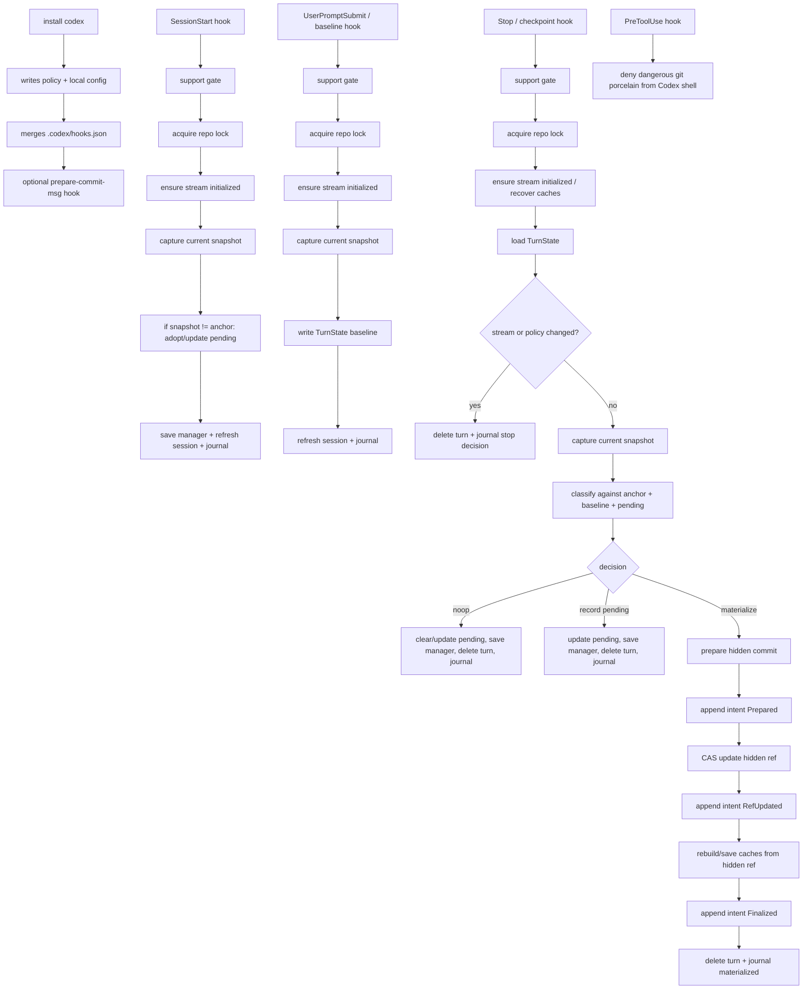
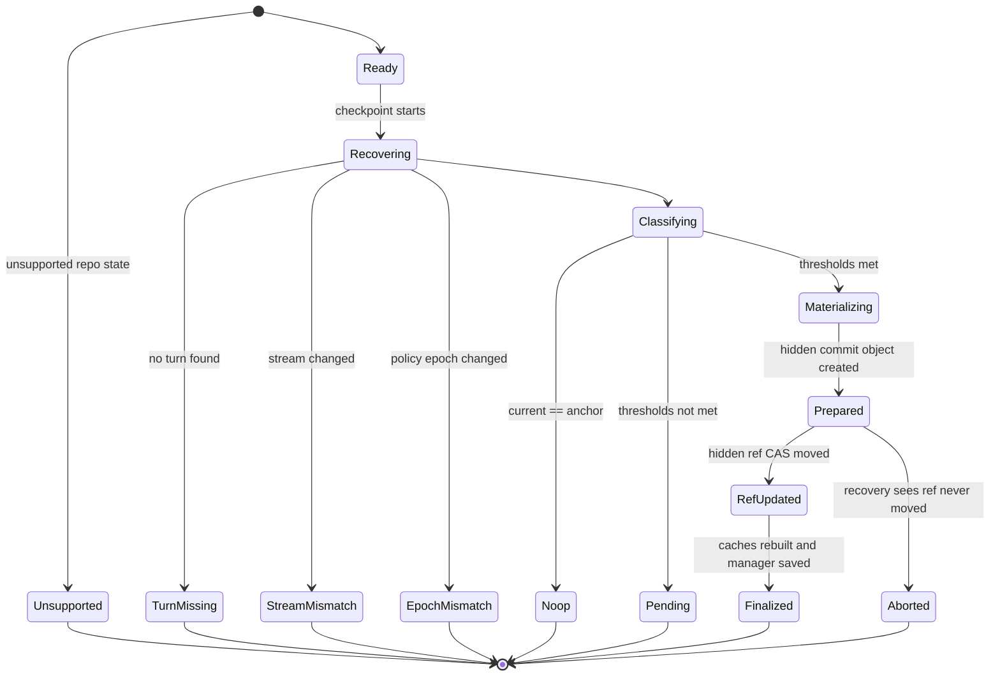
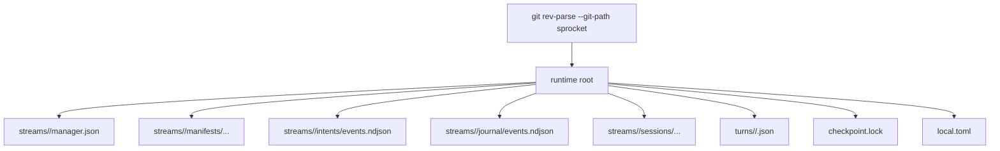

# Sprocket Architecture

This document describes what the current codebase actually does today.

## Start Here

If you want to read the code in the right order, start with:

1. `/Users/daniel/Developer/sprocket/src/cli.rs`
2. `/Users/daniel/Developer/sprocket/src/app/install_codex.rs`
3. `/Users/daniel/Developer/sprocket/src/app/session_start.rs`
4. `/Users/daniel/Developer/sprocket/src/app/baseline.rs`
5. `/Users/daniel/Developer/sprocket/src/app/checkpoint.rs`
6. `/Users/daniel/Developer/sprocket/src/domain/decision.rs`
7. `/Users/daniel/Developer/sprocket/src/domain/manager.rs`
8. `/Users/daniel/Developer/sprocket/src/domain/turn.rs`
9. `/Users/daniel/Developer/sprocket/src/engine/init_stream.rs`
10. `/Users/daniel/Developer/sprocket/src/engine/repair.rs`
11. `/Users/daniel/Developer/sprocket/src/engine/observe.rs`
12. `/Users/daniel/Developer/sprocket/src/engine/materialize_hidden.rs`
13. `/Users/daniel/Developer/sprocket/src/infra/store.rs`
14. `/Users/daniel/Developer/sprocket/src/infra/git_cli.rs`

## What Sprocket Is

Sprocket is a hidden-only Git checkpoint engine wired into Codex hook flows.

At a high level it:

- installs Codex hooks into a repo
- observes the owned surface of the working tree
- tracks pending dirty state across turns
- creates hidden checkpoint commits under private refs when thresholds are met
- treats the hidden ref tip as committed truth
- treats the intent log as in-flight transaction truth
- treats manager and manifest files as rebuildable caches

The main hook entrypoints are:

- `install codex`
- `hook codex session-start`
- `hook codex baseline`
- `hook codex checkpoint`
- `hook codex pre-tool-use`

## Top-Level Flow

## Core State Model

The important units of state are:

- `Stream`
  - a worktree + branch line of work
  - current automatic support is branch streams only
- `Anchor`
  - the current committed hidden checkpoint for a stream
  - authoritative committed truth is the hidden ref tip
- `PendingEpisode`
  - stream-local record of dirty state that has not yet been checkpointed
- `Turn`
  - a short-lived baseline created at prompt submit and consumed at stop
- `Intent`
  - append-only transaction phases for a checkpoint operation

The current authoritative model is:

- committed authority: hidden ref tip
- in-flight authority: intent log
- caches: manager + manifest files

## Checkpoint Transaction

## What Each Hook Does

### `session-start`

`/Users/daniel/Developer/sprocket/src/app/session_start.rs`

This hook:

- resolves repo, head, stream, policy, and runtime stores
- rejects unsupported repo states early
- acquires the repo lock
- ensures the stream is initialized or reconciled
- captures a current snapshot of owned files
- compares the current snapshot to the anchor
- updates or clears pending dirty state
- refreshes the session record
- appends a journal entry

This is mostly a stream reconciliation and pending-adoption step.

### `baseline`

`/Users/daniel/Developer/sprocket/src/app/baseline.rs`

This hook:

- resolves the same repo/stream/policy context
- ensures the stream is initialized
- captures the current snapshot
- writes a `TurnState`

The turn stores:

- `stream_id_at_start`
- `stream_class_at_start`
- `policy_epoch_at_start`
- `baseline_materialized_fingerprint`
- `anchor_materialized_fingerprint_at_start`

This is the start-of-turn comparison point.

### `checkpoint`

`/Users/daniel/Developer/sprocket/src/app/checkpoint.rs`

This is the real state machine.

It:

1. resolves repo, head, stream, policy, and stores
2. support-gates early
3. acquires the repo lock
4. reconciles hidden-ref state and cache state
5. loads the turn
6. exits cleanly if stream or policy epoch changed
7. captures a fresh snapshot
8. classifies the current state against anchor + baseline + pending
9. either:
   - noops
   - records pending
   - or materializes a hidden checkpoint transaction

### `pre-tool-use`

`/Users/daniel/Developer/sprocket/src/app/pre_tool_use.rs`

This is not part of checkpoint correctness. It is just a guardrail that blocks dangerous Git commands from Codex Bash usage.

## Snapshot Model

`/Users/daniel/Developer/sprocket/src/engine/observe.rs`

The snapshot engine:

- enumerates owned present paths
- reads file or symlink contents
- computes:
  - `observed_digest` from raw bytes
  - `git_oid` from Git blob hashing
- builds a `StrictSnapshot`

Each snapshot has:

- `materialized_fingerprint`
  - authoritative
  - derived from `(path, mode, git_oid)`
- `observed_fingerprint`
  - diagnostic only
  - derived from `(path, mode, observed_digest)`

The checkpoint engine uses the materialized fingerprint for convergence and anchor identity.

## Hidden Commit Materialization

`/Users/daniel/Developer/sprocket/src/engine/materialize_hidden.rs`

When the decision is `Materialize`, Sprocket:

1. creates a temp Git index
2. optionally seeds it from `HEAD`
3. removes owned paths that should be deleted
4. inserts all snapshot entries into the temp index with `update-index --index-info`
5. writes a tree from the temp index
6. creates a hidden commit with `git commit-tree`
7. later CAS-updates the stream hidden ref to that commit

Each hidden checkpoint commit carries machine footers such as:

- `Sprocket-Generation`
- `Sprocket-Policy-Epoch`
- `Sprocket-Stream-Class`
- `Sprocket-Observed-Head-Ref`
- `Sprocket-Observed-Head-Oid`
- `Sprocket-Materialized-Fingerprint`
- optional `Sprocket-Observed-Fingerprint`

Those footers plus the commit tree are used for recovery.

## Classification Logic

`/Users/daniel/Developer/sprocket/src/domain/decision.rs`

The classifier decides:

- `Noop`
- `RecordPending`
- `Materialize`

It compares:

- current stream vs turn-start stream
- current materialized fingerprint vs anchor fingerprint
- current materialized fingerprint vs turn baseline fingerprint
- pending episode age / turn count
- changed path count
- policy thresholds

This is where “checkpoint now or wait” lives.

## Recovery Model

`/Users/daniel/Developer/sprocket/src/engine/repair.rs`

Recovery works like this:

1. read the stream hidden ref tip
2. load intents and reduce them to latest phase per intent id
3. reconcile incomplete intents
   - `Prepared` with no matching ref move becomes `Aborted`
   - `Prepared` or `RefUpdated` matching the current tip becomes `Finalized`
4. rebuild the current snapshot from the hidden commit tree
5. parse checkpoint footers from the hidden commit message
6. rebuild manager state from hidden-ref truth
7. restore missing manifest cache if needed

This means manager/manifests can be deleted and rebuilt from the hidden ref tip plus commit metadata.

## Runtime Layout

The relevant code is in `/Users/daniel/Developer/sprocket/src/infra/store.rs`.

## Git Boundary

`/Users/daniel/Developer/sprocket/src/infra/git_cli.rs`

The Git adapter is responsible for:

- resolving repo root and git-path locations
- reading `HEAD` state
- checking repo state flags
- listing tree entries with `git ls-tree -r -z`
- listing present working-tree paths
- hashing blobs with `git hash-object`
- writing temp-index trees
- creating commits with `git commit-tree`
- moving refs with `git update-ref`

This is the boundary between Sprocket's domain logic and actual Git plumbing.

## Support Envelope

`/Users/daniel/Developer/sprocket/src/app/support.rs`

The code currently rejects early for:

- detached `HEAD`
- merge/rebase/cherry-pick/sequencer states
- sparse checkout
- gitlinks/submodules under owned paths
- any `.gitattributes` in the repo
- unsupported checkpoint modes

So the current intended product is:

- hidden-only
- attached-branch only
- Unix-oriented
- no filter-sensitive exactness claims
- no automatic visible promotion

## What To Keep In Your Head

If you only remember five things, remember these:

1. `session-start` updates stream state and pending adoption.
2. `baseline` records one turn's starting point.
3. `checkpoint` is the real decision + transaction engine.
4. the hidden ref tip is the committed checkpoint truth.
5. manager and manifest files are caches around that truth, not the truth itself.

## Current Gaps

The current code still has some important limits:

- `doctor`, `repair`, `validate`, and `migrate` are still placeholder CLI commands in `/Users/daniel/Developer/sprocket/src/cli.rs`
- visible promotion is deferred rather than redesigned
- detached/rewrite flows are rejected rather than modeled
- the support envelope is intentionally narrow
