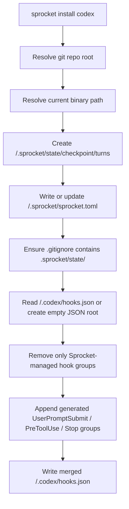
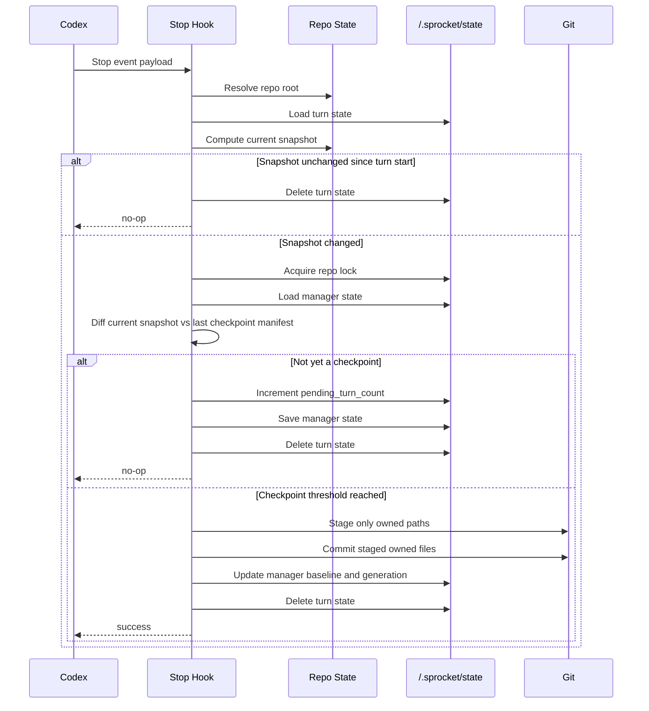
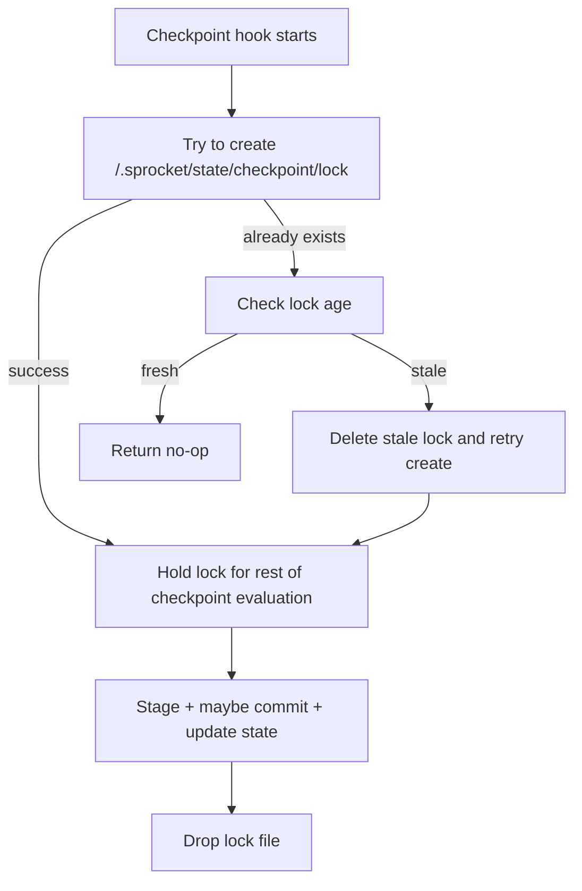

# Sprocket Commit System

This document is the master technical spec for Sprocket's first commit-core backend: the Codex smart local commit system.

It is written so another engineer can recreate the system from scratch without needing to reverse-engineer the codebase.

The current implementation lives in:

- [src/lib.rs](/Users/daniel/Developer/Sprocket/src/lib.rs)
- [src/main.rs](/Users/daniel/Developer/Sprocket/src/main.rs)

## 1. Purpose

The system exists to give Codex a safe, bounded, local-only autosave mechanism.

It does four things:

1. installs Codex hook wiring into a repo
2. snapshots the meaningful repo state at the start of a turn
3. decides at the end of a turn whether a checkpoint commit should be created
4. blocks direct git mutation commands from the agent so Sprocket remains the sole commit path

This milestone is intentionally narrow.

It does **not** include:

- startup dirty-state adoption
- milestone docs refresh
- stale-session warnings
- Python profile logic
- multi-backend support beyond Codex

## 2. System Boundary

The design has a strict split between the product runtime and the Codex adapter.

### Canonical product home

Sprocket owns:

- `/.sprocket/sprocket.toml`
- `/.sprocket/state/...`

### Backend adapter layer

Codex owns:

- `/.codex/hooks.json`

Sprocket writes into `/.codex/hooks.json`, but `/.codex/` is not the product's canonical home. It is only the Codex-facing adapter surface.

## 3. Repo Contract

After `sprocket install codex`, a repo should contain these relevant surfaces:

```text
repo/
├── .codex/
│   └── hooks.json
├── .sprocket/
│   ├── sprocket.toml
│   └── state/
│       └── checkpoint/
│           ├── lock
│           ├── manager.json
│           └── turns/
│               └── <turn-id>.json
└── .gitignore
```

Sprocket also appends this ignore rule if missing:

```gitignore
.sprocket/state/
```

## 4. CLI Surface

The first backend-facing command surface is:

```text
sprocket install codex
sprocket hook codex baseline
sprocket hook codex pre-tool-use
sprocket hook codex checkpoint
```

The main binary is only a thin CLI wrapper:

```rust
fn main() {
    let exit_code = match sprocket::run(std::env::args()) {
        Ok(()) => 0,
        Err(error) => {
            eprintln!("{error}");
            1
        }
    };
    std::process::exit(exit_code);
}
```

## 5. Install Flow

`sprocket install codex` does the following:

1. resolves the target repo root via `git rev-parse --show-toplevel`
2. resolves the current Sprocket binary path with `current_exe()`
3. creates `/.sprocket/` state directories
4. writes or updates `/.sprocket/sprocket.toml`
5. appends `.sprocket/state/` to `.gitignore` if needed
6. creates or safely merges `/.codex/hooks.json`

### Install algorithm



## 6. Generated Codex Hook Wiring

Sprocket installs three Codex events.

### `UserPromptSubmit`

Runs the baseline capture step:

```json
{
  "hooks": [
    {
      "type": "command",
      "command": "'/abs/path/to/sprocket' --sprocket-managed hook codex baseline"
    }
  ]
}
```

### `PreToolUse` on `Bash`

Runs the git mutation guard:

```json
{
  "matcher": "Bash",
  "hooks": [
    {
      "type": "command",
      "command": "'/abs/path/to/sprocket' --sprocket-managed hook codex pre-tool-use"
    }
  ]
}
```

### `Stop`

Runs checkpoint evaluation:

```json
{
  "hooks": [
    {
      "type": "command",
      "command": "'/abs/path/to/sprocket' --sprocket-managed hook codex checkpoint",
      "timeout": 120,
      "statusMessage": "Evaluating Sprocket checkpoint state..."
    }
  ]
}
```

## 7. Hook Ownership and Safe Merge

Sprocket must coexist with unrelated Codex hooks.

The merge rule is:

- preserve unrelated existing hook groups
- delete only groups whose nested hook commands contain the stable marker `--sprocket-managed`
- append the new Sprocket-managed group for each event

That makes reinstall idempotent without owning the whole `hooks.json` file.

### Why the hidden marker exists

The marker is not the binary name. It is a stable flag:

```rust
const SPROCKET_HOOK_MARKER: &str = "--sprocket-managed";
```

That matters because:

- `current_exe()` differs in tests vs normal runs
- binary names can vary by install path
- hook ownership must remain detectable even when the binary path changes

The CLI strips this flag before dispatching commands, so it is only there for hook ownership and hook identification.

## 8. Config Model

The first config is intentionally small.

```toml
version = 1

[backend.codex]
binary_path = "/absolute/path/to/sprocket"

[commit]
owned_paths = ["src", "tests"]
checkpoint_turn_threshold = 2
checkpoint_file_threshold = 3
checkpoint_age_minutes = 20
lock_timeout_seconds = 300
default_area = "core"
message_template = "checkpoint({area}): save current work [auto]"
```

### Config responsibilities

`backend.codex.binary_path`
- records which binary path the repo is currently wired to

`commit.owned_paths`
- defines which paths are meaningful for baseline snapshots and eligible for auto-commit staging

`commit.*thresholds`
- control when a turn becomes a checkpoint

`commit.message_template`
- allows commit message construction without hardcoding the full message forever

## 9. State Model

The system uses two persisted state files.

### Manager state

Path:

```text
/.sprocket/state/checkpoint/manager.json
```

Fields:

- `version`
- `generation`
- `last_checkpoint_fingerprint`
- `last_checkpoint_manifest`
- `last_checkpoint_commit`
- `last_checkpoint_at`
- `pending_turn_count`
- `pending_first_seen_at`
- `pending_last_seen_at`

Purpose:

- tracks the repo’s last committed meaningful state
- tracks checkpoint cadence
- increments `generation` every time Sprocket creates a checkpoint commit

### Turn state

Path:

```text
/.sprocket/state/checkpoint/turns/<turn-id>.json
```

Fields:

- `version`
- `turn_id`
- `started_at`
- `baseline_fingerprint`
- `baseline_manifest`

Purpose:

- stores the baseline meaningful state captured at `UserPromptSubmit`
- lets `Stop` compare “state at turn start” vs “state at turn end”

## 10. Meaningful Snapshot Model

The commit system does not inspect the whole repo. It only looks at configured owned paths.

The snapshot algorithm is:

1. ask git for tracked files under owned paths
2. ask git for deleted files under owned paths
3. ask git for untracked files under owned paths
4. build a manifest of present files and deleted paths
5. hash the manifest into a stable fingerprint

Present manifest entries look like:

```json
{
  "path": "src/main.py",
  "status": "present",
  "sha256": "<file-digest>"
}
```

Deleted manifest entries look like:

```json
{
  "path": "tests/test_main.py",
  "status": "deleted"
}
```

The fingerprint is:

```text
sha256:<hash of serialized manifest>
```

### Why this design works

- tracked + untracked files matter because Codex may create new files
- deletions matter because removing files is meaningful work
- hashing the manifest gives a compact stable identity for state comparisons

## 11. Baseline Hook Behavior

The baseline hook is triggered by `UserPromptSubmit`.

It does three things:

1. computes the current meaningful snapshot
2. initializes manager baseline if none exists yet
3. writes the turn state for the current turn

### Important bootstrap behavior

The first time the repo uses Sprocket, there may be no checkpoint baseline yet.

Without special handling, the first checkpoint diff would compare against an empty manifest and incorrectly treat the whole repo as new work.

So baseline capture initializes manager state like this when empty:

```rust
if manager.last_checkpoint_fingerprint.is_none() {
    manager.last_checkpoint_fingerprint = Some(snapshot.fingerprint.clone());
    manager.last_checkpoint_manifest = snapshot.manifest.clone();
    manager.last_checkpoint_commit = current_head(&repo)?;
    manager.last_checkpoint_at = Some(now_unix_seconds());
    save_manager_state(&repo, &manager)?;
}
```

That makes the current repo state the starting baseline instead of forcing a bogus first autosave.

## 12. Stop Hook Behavior

The checkpoint hook runs at `Stop`.

Its job is to decide whether the turn should produce a local checkpoint commit.

### High-level algorithm



### Early exit conditions

The hook no-ops when:

- no turn state exists
- current fingerprint equals turn baseline fingerprint
- current fingerprint already equals last checkpoint fingerprint
- the owned path stage step yields no staged changes

## 13. Delta Computation

The system diffs:

- `manager.last_checkpoint_manifest`
- current snapshot manifest

The diff produces:

- `added`
- `modified`
- `deleted`
- `changed_paths`

This is enough for v1 because the system only classifies:

- `none`
- `checkpoint`

There is no `milestone` class yet.

## 14. Checkpoint Classification

V1 checkpoint classification is intentionally simple.

The system should checkpoint when any of these are true:

1. `pending_turn_count + 1 >= checkpoint_turn_threshold`
2. `changed_file_count >= checkpoint_file_threshold`
3. `now - last_checkpoint_at >= checkpoint_age_minutes`

Implementation shape:

```rust
fn should_checkpoint(delta: &Delta, manager: &ManagerState, config: &CommitConfig) -> bool {
    if delta.changed_paths.is_empty() {
        return false;
    }
    if manager.pending_turn_count + 1 >= config.checkpoint_turn_threshold {
        return true;
    }
    if delta.changed_paths.len() as u32 >= config.checkpoint_file_threshold {
        return true;
    }
    let Some(last_checkpoint_at) = manager.last_checkpoint_at else {
        return false;
    };
    now_unix_seconds().saturating_sub(last_checkpoint_at)
        >= config.checkpoint_age_minutes.saturating_mul(60)
}
```

If no checkpoint is created, the manager records a pending turn:

- increment `pending_turn_count`
- set `pending_first_seen_at` if empty
- update `pending_last_seen_at`

## 15. Staging and Commit Boundaries

Sprocket must never commit the whole repo indiscriminately.

The stage rule is:

- stage only configured owned paths
- commit only staged files that actually changed inside that bounded set

This is what keeps the autosave local, predictable, and safe.

### Stage logic

```rust
let staged = stage_pathspecs(&repo, &config.commit.owned_paths)?;
if !staged_changes_exist(&repo, &staged)? {
    return Ok(());
}
```

### Commit logic

The commit path first asks git which staged files actually changed, then commits only those files.

That prevents a repo-wide commit from accidentally picking up unrelated staged state.

## 16. Commit Message Policy

V1 uses a templated local commit message:

```text
checkpoint({area}): save current work [auto]
```

And substitutes:

- `{area}` with `default_area`

In the first milestone the area is config-driven and defaults to `core`.

This is intentionally minimal because profile-specific area inference does not exist yet.

## 17. Repo Locking

The system must serialize competing checkpoint attempts within one repo.

Lock path:

```text
/.sprocket/state/checkpoint/lock
```

Lock behavior:

- create with `create_new(true)` so acquisition is atomic
- if a live lock exists, no-op instead of blocking
- if the lock is stale beyond `lock_timeout_seconds`, delete and replace it

### Lock lifecycle



This is not a distributed lock. It is a repo-local lock for concurrent Codex sessions on one machine or shared filesystem context.

## 18. Direct Git Mutation Guard

Codex is allowed to edit files, but it is not allowed to own commits.

The pre-tool-use hook parses the `Bash` command text and denies mutating git commands such as:

- `git add`
- `git commit`
- `git merge`
- `git rebase`
- `git cherry-pick`
- `git push`
- `git tag`
- `git stash`
- `git am`
- `git reset --hard`

Allowed example:

- `git status --short`

Denied response shape:

```json
{
  "hookSpecificOutput": {
    "hookEventName": "PreToolUse",
    "permissionDecision": "deny",
    "permissionDecisionReason": "Commits are owned by Sprocket. Make code changes only."
  }
}
```

This keeps the commit path centralized inside Sprocket rather than split across ad hoc git calls.

## 19. Failure Semantics

The v1 hook path is intentionally soft-fail.

If the hook cannot proceed, the correct behavior is usually:

- no-op
- do not corrupt repo state
- do not create a partial commit

Examples:

- no turn state found -> return
- live lock held by another checkpoint -> return
- no staged owned changes -> return
- unchanged snapshot -> return

This keeps the commit system conservative.

## 20. Reimplementation Checklist

If you were rebuilding this system in another codebase or language, you must reproduce these invariants:

1. `/.sprocket/` is canonical; `/.codex/` is adapter-only.
2. Hook installation merges safely and removes only Sprocket-managed groups.
3. `UserPromptSubmit` captures a baseline snapshot for the current turn.
4. First baseline initializes manager checkpoint state when empty.
5. `Stop` compares current snapshot against:
   - turn baseline
   - last checkpoint baseline
6. Only owned paths affect snapshots and commits.
7. Checkpoint classification is threshold-based and repo-local.
8. State lives under `/.sprocket/state/`.
9. A repo-local lock serializes checkpoint attempts.
10. Direct git mutation commands from the agent are denied.

If any one of those is missing, the recreated system is not functionally equivalent.

## 21. Minimal Reconstruction Pseudocode

```text
install codex:
  resolve repo root
  resolve current binary path
  ensure /.sprocket/state/checkpoint/turns
  write or merge /.sprocket/sprocket.toml
  add .sprocket/state/ to .gitignore
  merge /.codex/hooks.json with three generated hook groups

baseline hook:
  load payload
  resolve repo root
  load config
  snapshot owned paths
  if manager baseline missing:
    initialize manager baseline from current snapshot and current HEAD
  save turn state keyed by turn id

pre-tool-use hook:
  parse command text from payload
  if command is a mutating git command:
    emit Codex deny JSON

checkpoint hook:
  load payload
  resolve repo root
  load config
  resolve turn state
  snapshot owned paths
  if snapshot == turn baseline: return
  acquire repo-local lock or return
  load manager state
  if snapshot == last checkpoint baseline: return
  diff manager manifest vs current manifest
  if delta empty: return
  if checkpoint thresholds not met:
    record pending turn and return
  stage owned paths
  if no staged changes: return
  commit staged changed files only
  update manager state
  delete turn state
```

## 22. Current Limitations

This file documents the current v1 commit-core system, not the intended future system.

Known intentional omissions:

- no docs worker
- no startup adoption
- no session registry
- no stale-session warnings
- no milestone class
- no profile-aware area inference

Those belong to later milestones.
