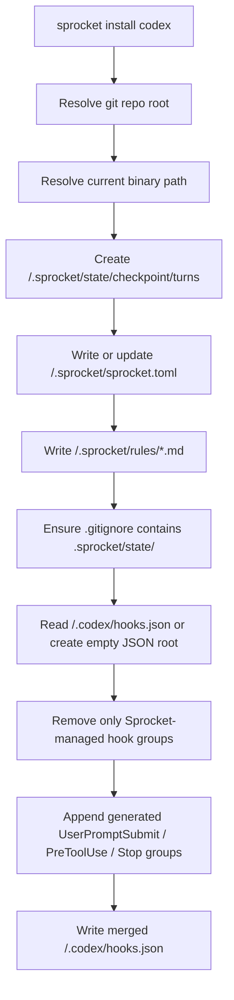
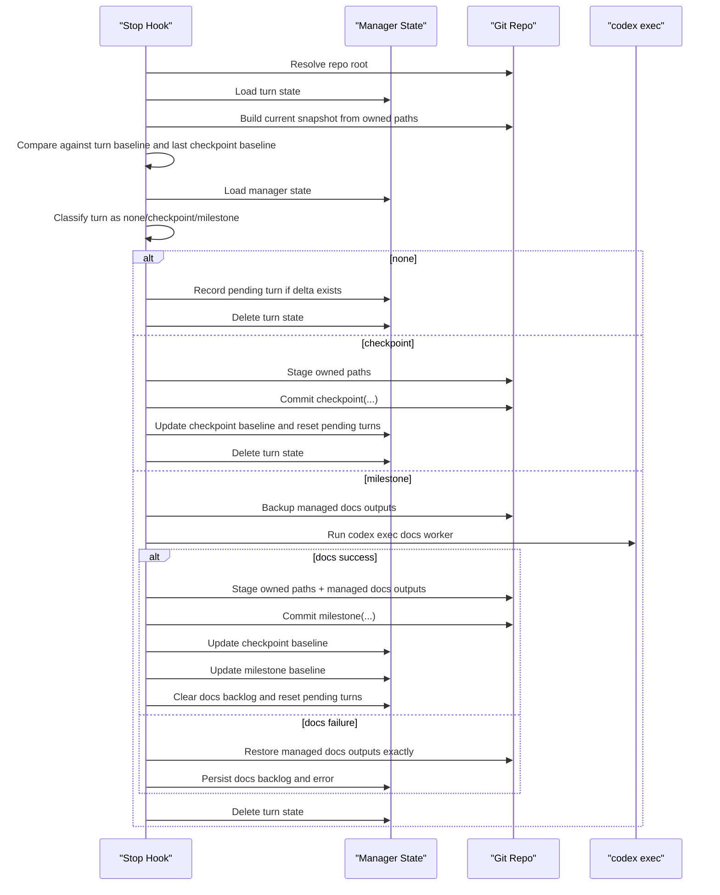

# Sprocket Commit System

This is the master technical spec for Sprocket's current Codex commit system.

It is written so another engineer can recreate the system from scratch without reverse-engineering the codebase.

The current implementation lives in:

- [src/lib.rs](/Users/daniel/Developer/Sprocket/src/lib.rs)
- [src/config.rs](/Users/daniel/Developer/Sprocket/src/config.rs)
- [src/classification.rs](/Users/daniel/Developer/Sprocket/src/classification.rs)
- [src/docs_worker.rs](/Users/daniel/Developer/Sprocket/src/docs_worker.rs)
- [src/main.rs](/Users/daniel/Developer/Sprocket/src/main.rs)

## 1. Purpose

The system gives Codex a safe, bounded, local-only commit path with milestone-gated docs maintenance.

It does five things:

1. installs Codex hook wiring into a repo
2. snapshots the meaningful repo state at the start of a turn
3. classifies end-of-turn work as `none`, `checkpoint`, or `milestone`
4. runs a synchronous docs worker before milestone commits
5. blocks direct git mutation commands so Sprocket remains the only blessed autosave path

It still does **not** include:

- startup dirty-state adoption
- stale-session warnings
- multi-backend support beyond Codex
- profile-specific language semantics beyond the generic trigger defaults

## 2. System Boundary

Sprocket keeps a strict split between product state and backend adapter state.

### Canonical product home

Sprocket owns:

- `/.sprocket/sprocket.toml`
- `/.sprocket/rules/project.md`
- `/.sprocket/rules/architecture.md`
- `/.sprocket/state/...`

### Backend adapter layer

Codex owns:

- `/.codex/hooks.json`

Sprocket writes into `/.codex/hooks.json`, but `/.codex/` is adapter wiring only.

## 3. Repo Contract

After `sprocket install codex`, a repo should contain these relevant surfaces:

```text
repo/
├── .codex/
│   └── hooks.json
├── .sprocket/
│   ├── rules/
│   │   ├── architecture.md
│   │   └── project.md
│   ├── sprocket.toml
│   └── state/
│       └── checkpoint/
│           ├── lock
│           ├── manager.json
│           └── turns/
│               └── <turn-id>.json
└── .gitignore
```

Sprocket also appends:

```gitignore
.sprocket/state/
```

The docs worker may later create and maintain:

- `docs/ARCHITECTURE.md`
- `docs/project/llms/llms.txt`

Those paths are configurable, but they are the built-in defaults.

## 4. Public CLI Surface

The current public CLI is:

```text
sprocket install codex
sprocket hook codex baseline
sprocket hook codex pre-tool-use
sprocket hook codex checkpoint
```

The binary entrypoint is intentionally thin:

```rust
fn main() {
    let exit_code = match sprocket::run(std::env::args()) {
        Ok(()) => 0,
        Err(error) => {
            eprintln!("{error}");
            1
        }
    };
    std::process::exit(exit_code);
}
```

## 5. Install Flow

`sprocket install codex` does the following:

1. resolves the target repo root with `git rev-parse --show-toplevel`
2. resolves the current Sprocket binary path with `current_exe()`
3. creates `/.sprocket/state/checkpoint/turns`
4. writes or updates `/.sprocket/sprocket.toml`
5. writes `/.sprocket/rules/project.md` and `/.sprocket/rules/architecture.md`
6. appends `.sprocket/state/` to `.gitignore` if needed
7. creates or safely merges `/.codex/hooks.json`



## 6. Generated Codex Hook Wiring

Sprocket installs three Codex events.

### `UserPromptSubmit`

Captures the baseline snapshot:

```json
{
  "hooks": [
    {
      "type": "command",
      "command": "'/abs/path/to/sprocket' --sprocket-managed hook codex baseline"
    }
  ]
}
```

### `PreToolUse` on `Bash`

Blocks direct git mutation commands:

```json
{
  "matcher": "Bash",
  "hooks": [
    {
      "type": "command",
      "command": "'/abs/path/to/sprocket' --sprocket-managed hook codex pre-tool-use"
    }
  ]
}
```

### `Stop`

Runs the commit classifier and optional docs worker:

```json
{
  "hooks": [
    {
      "type": "command",
      "command": "'/abs/path/to/sprocket' --sprocket-managed hook codex checkpoint",
      "timeout": 120,
      "statusMessage": "Evaluating Sprocket checkpoint state..."
    }
  ]
}
```

## 7. Hook Ownership and Safe Merge

Sprocket must coexist with unrelated Codex hooks.

The merge rule is:

- preserve unrelated existing hook groups
- delete only groups whose nested hook commands contain the stable marker `--sprocket-managed`
- append the new Sprocket-managed group for each event

The marker is intentionally path-stable:

```rust
const SPROCKET_HOOK_MARKER: &str = "--sprocket-managed";
```

That avoids coupling hook ownership to the current binary path.

## 8. Config Model

The repo-local source of truth is `/.sprocket/sprocket.toml`.

Current shape:

```toml
version = 1

[backend.codex]
binary_path = "/absolute/path/to/sprocket"

[commit]
owned_paths = ["src", "tests"]
checkpoint_turn_threshold = 2
checkpoint_file_threshold = 3
checkpoint_age_minutes = 20
milestone_file_threshold = 6
lock_timeout_seconds = 300
default_area = "core"
checkpoint_message_template = "checkpoint({area}): save current work [auto]"
milestone_message_template = "milestone({area}): sync docs and save current work [auto]"

[docs]
enabled = true
managed_outputs = ["docs/ARCHITECTURE.md", "docs/project/llms/llms.txt"]
timeout_seconds = 90
model = "gpt-5.3-codex-spark"
reasoning_effort = "medium"
sandbox = "workspace-write"
approval = "never"
disable_codex_hooks = true
recreate_missing = true
instructions = ""

[docs.triggers]
source_roots = ["src"]
test_roots = ["tests"]
milestone_globs = [
  "pyproject.toml",
  "package.json",
  "Cargo.toml",
  "justfile",
  "Makefile",
  "Dockerfile",
  ".github/workflows/**",
]
```

Important validation rule:

- `docs.managed_outputs` must not overlap `commit.owned_paths`

That prevents docs maintenance from self-triggering commit loops.

## 9. State Model

The runtime persists two state files.

### Manager state

Path:

```text
/.sprocket/state/checkpoint/manager.json
```

Important fields:

- `generation`
- `last_checkpoint_fingerprint`
- `last_checkpoint_manifest`
- `last_checkpoint_commit`
- `last_checkpoint_at`
- `last_milestone_fingerprint`
- `last_milestone_manifest`
- `pending_turn_count`
- `pending_first_seen_at`
- `pending_last_seen_at`
- `docs_backlog`
- `last_docs_attempt_at`
- `last_docs_error`

### Turn state

Path:

```text
/.sprocket/state/checkpoint/turns/<turn-id>.json
```

Fields:

- `turn_id`
- `started_at`
- `baseline_fingerprint`
- `baseline_manifest`

The turn file is ephemeral and removed when the `Stop` hook finishes handling that turn.

## 10. Meaningful Snapshot Model

Baseline and checkpoint diffs only look at `commit.owned_paths`.

That means:

- code changes inside the owned surface can trigger commits
- docs outputs are not part of the fingerprint basis
- changes only to docs outputs do not create new auto-commits

The snapshot manifest stores per-path status and content hash:

```rust
#[derive(Debug, Clone, Serialize, Deserialize, PartialEq, Eq)]
struct ManifestEntry {
    path: String,
    status: String,
    sha256: Option<String>,
}
```

## 11. Classification Model

The `Stop` hook compares:

- current snapshot vs turn baseline
- current snapshot vs last checkpoint baseline
- current manifest vs last checkpoint manifest

Then it classifies the turn as:

- `none`
- `checkpoint`
- `milestone`

Classification order:

1. `none` if current fingerprint equals the turn baseline
2. `none` if current fingerprint equals the last checkpoint fingerprint
3. compute manifest delta
4. `none` if delta is empty
5. `milestone` if `docs_backlog = true`
6. `milestone` if `changed_file_count >= milestone_file_threshold`
7. `milestone` if any changed path matches `docs.triggers.milestone_globs`
8. `milestone` if a file was added or deleted under `docs.triggers.source_roots`
9. `milestone` if there are both source-root and test-root changes and at least one pending turn
10. `checkpoint` if checkpoint thresholds are met
11. otherwise `none`

Checkpoint thresholds are:

- pending turns reached `checkpoint_turn_threshold`
- changed files reached `checkpoint_file_threshold`
- enough time passed since `last_checkpoint_at`

## 12. Stop Hook Algorithm



## 13. Docs Worker Contract

Milestone commits launch a synchronous `codex exec` process.

Pattern:

```bash
codex exec --ephemeral --ask-for-approval never --sandbox workspace-write \
  -m gpt-5.3-codex-spark \
  -c model_reasoning_effort="medium" \
  -C <repo> \
  --disable codex_hooks \
  "<prompt>"
```

The prompt is composed from:

- built-in Sprocket docs instructions, unless `docs.instructions` overrides them
- `/.sprocket/rules/project.md`
- `/.sprocket/rules/architecture.md`
- the configured managed output list
- a JSON summary of the current manifest delta

Worker rules:

- may edit only `docs.managed_outputs`
- may recreate missing docs when `docs.recreate_missing = true`
- must no-op cleanly when docs are already current
- must not touch code, tests, `/.sprocket/state/`, or `/.codex/hooks.json`

## 14. Commit Messages

Current commit messages are area-stable and use the config-driven default area:

- `checkpoint(core): save current work [auto]`
- `milestone(core): sync docs and save current work [auto]`

The area is still config-driven in this milestone; there is no dynamic area inference yet.

## 15. Locking

The system serializes competing `Stop` hooks with a repo-local lock:

```text
/.sprocket/state/checkpoint/lock
```

Behavior:

- create with `O_CREAT | O_EXCL`
- if an existing lock is older than `lock_timeout_seconds`, delete and replace it
- hold the lock for the full `Stop`-hook run
- release it on drop

That means both checkpoint commits and docs-bearing milestone commits are single-writer operations inside one repo.

## 16. Failure Model

Important failure rules:

- if no turn state exists, the `Stop` hook exits quietly
- if the live lock is held, the `Stop` hook exits quietly
- if docs worker fails or times out, no milestone commit is created
- docs failure restores managed docs outputs exactly to their pre-run bytes
- docs failure leaves code changes uncommitted and sets `docs_backlog = true`
- backlog forces the next eligible `Stop` back through milestone docs sync

## 17. Reconstruction Checklist

To recreate this system from scratch:

1. Install repo-local config under `/.sprocket/` and Codex hook wiring under `/.codex/`.
2. Capture a turn baseline on `UserPromptSubmit`.
3. Keep meaningful snapshots limited to `commit.owned_paths`.
4. Persist manager and turn state under `/.sprocket/state/checkpoint/`.
5. Classify `Stop` work into `none`, `checkpoint`, or `milestone`.
6. Run `codex exec` only for milestones and only before the commit.
7. Back up and restore managed docs around docs-worker failure.
8. Stage only owned code paths plus managed docs outputs when docs ran successfully.
9. Block direct git mutations through the `PreToolUse` hook.
10. Use a repo-local lock for the full `Stop`-hook path.
